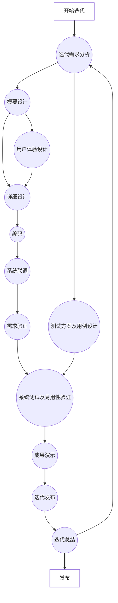
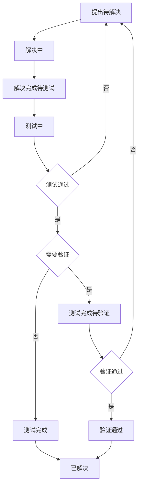

# 研发管理流程
## 开发流程

### 需要评审的环节
- 系统分析
- 架构设计
### 各环节参与者及成果物
#### 系统分析
- 主要角色：研发经理、系统分析师
- 输出：系统分析文档
#### 架构设计
- 主要角色：研发经理、架构师
- 输出：总体设计文档
#### 进入迭代
- 主要角色：经理、需求、开发、测试人员共同参与
- 输出：详见[迭代流程](#迭代流程)

## 迭代流程

### 需要评审的环节
- 迭代需求范围及需求具体分析
- 测试方案和测试用例设计
- 概要设计
- 用户体验设计
### 各环节参与者及成果物
#### 迭代需求分析
- 主要角色：需求工程师
- 输出：需求规格说明书、功能原型
#### 概要设计
- 主要角色：高级软件工程师
- 输出：概要设计文档
#### 用户体验设计
- 主要角色：设计经理、用户体验设计师
- 输出：高保真原型、视觉图、静态html（切图/css/js）
#### 测试方案及用例设计
- 主要角色：测试经理、测试工程师
- 输出：测试方案、测试用例
#### 详细设计
- 主要角色：开发工程师
- 输出：详细设计文档
#### 编码
- 主要角色：开发工程师
- 输出：源代码、软件安装包、软件实施部署说明
#### 系统联调
- 主要角色：开发工程师
- 输出：系统联调方案、实际联调、联调缺陷跟踪
#### 需求验证
- 主要角色：需求工程师
- 输出：验证缺陷跟踪
#### 系统测试及易用性验证
- 主要角色：测试经理、设计经理、开发工程师、测试工程师
- 输出：易用性缺陷跟踪、易用性评价
#### 成果演示
- 演示会
#### 迭代发布
- 输出：软件安装包、数据库初始化\更新脚本、实施文档（全新部署\更新）、功能发布清单、用户手册
#### 迭代总结
- 主要角色：本次迭代全体参与者
- 输出：版本总结文档

## 项目上线

### 交付内容
- 功能发布清单
- 软件安装包
- 实施文档（全新部署\更新）
- 用户手册
- （及其他合同范围内所需文档）

## 后期维护
- 正常系统使用维护
- 系统日志收集及分析
- 缺陷记录
- 新需求记录
- 客户反馈收集及答复

# 各阶段核心关注点
## 规划阶段
- 需求交底
- 设计交底
- 风险识别
- 执行计划制定及评审
- 项目启动会
## 执行阶段
- 确定需求优先级及建立需求跟踪矩阵
- 快速迭代
- 每日快速站会
    > 昨日进度+今日计划+问题
	> 详细问题会后讨论
	> 总时间不超过15min
- 每周例会跟踪项目执行计划
    > **就单一Sprint而言，关注点如下：**
    > 1. sprint计划制定 
    > 2. sprint计划跟踪（结合看板、站会及周例会）
    > 3. sprint计划总结（单个sprint结束时）
- 定期坏代码总结
## 持续监控
- 项目周报
- 技术负责人里程碑成果演示
- 需求变更
- 预算变更
- 其他可能造成计划变更的触发事件
- 风险状态
## 收尾阶段
- 软件质量指标收集
- 特殊质量情况收集（如软件例外放行）
- 项目总结会

# 附录
## 缺陷
### 缺陷类型
- 系统联调缺陷
- 用例测试发现缺陷
- 需求验证缺陷
- 易用性验证缺陷
- 性能缺陷
### 缺陷状态

## 输出文档
| 文档类型 | 编写者 | 验收者 | 内容 | 格式（文件扩展名） |
| --- | --- | --- | --- | --- |
| 需求文档 | 需求工程师 | 综合评审 | 详见[需求文档关注点](#需求文档关注点) |  |
| 总体设计文档 | 架构师 | 综合评审 | 详见[总体设计文档关注点](#总体设计文档关注点) |  |
| 概要设计文档 | 高级工程师 | 上一级 | 详见[概要设计文档关注点](#概要设计文档关注点) |  |
| 详细设计文档 | 开发工程师 | 上一级 | 详见[详细设计文档关注点](#详细设计文档关注点) |  |
| 数据库设计文档 | 高级工程师or开发工程师 | 上一级 | 详见[数据库设计文档关注点](#数据库设计文档关注点) |  |
| 接口文档 | 高级工程师or开发工程师 | 上一级or交互方 | 详见[接口文档关注点](#接口文档关注点) |  |
| 功能\版本提测文档 | 开发工程师 | 测试工程师 | 详见[功能\版本提测文档关注点](#功能\版本提测文档关注点) |  |
| 测试方案文档 | 高级测试工程师 | 上一级 | 详见[测试方案文档关注点](#测试方案文档关注点) |  |
| 测试用例文档 | 测试工程师 | 上一级 | 详见[测试用例文档关注点](#测试用例文档关注点) |  |
| 实施文档（全新部署\更新） | 开发工程师 | 测试工程师 | 详见[实施文档关注点](#实施文档关注点) |  |
| 功能发布清单 | ？ | 需求or产品or用户 | 详见[功能发布清单关注点](#功能发布清单关注点) |  |
| 用户手册 | 需求工程师or产品工程师 | 需求or产品or用户 | 详见[用户手册关注点](#用户手册关注点) |  |
> 文档格式根据交互方、是否可修改、是否方便修改、是否方便传阅等实际需求决定
> 常见格式：pdf、docx、xlsx、md
> | 格式 | 可修改 | 修改代价 | git查看及修改 |
> | --- | --- | --- | --- |
> | pdf | √ | pdf文件编辑器或转换格式后修改 | 可查看不可修改 |
> | docx | √ | office应用 | × |
> | xlsx | √ | office应用 | × |
> | md | √ | 任意文本编辑器（如typora或预装MPE插件的VScode） | √ |
> | vsd | √ | 预装visio应用 | × |
> | xmind | √ | 预装xmind应用 | × |
> | pos | √ | onprocess网页导入即可修改 | × |
> | drawio | √ | draw.io网页版或应用版 | × |
### 各类文档核心关注点
#### 需求文档关注点
- 总述
    - 项目背景及目标
    - 影响范围
	    > 如需求变更频率、新增功能影响系统列表、历史数据处理等
    - 运行环境约束
	    > 包括网络环境、操作系统、主要构件要求、第三方构件使用约束等
- 功能需求
    - 功能点A
	    - 业务流程
		- 功能描述
		    > 包含详细描述、前置\后置、优先级及其他应提及的要素
		- 原型设计
	- 功能点B
- 非功能需求
    - 性能需求
	    > 用户量、并发量、高峰期、数据处理性能要求等
	- 运行需求
        > 故障处理、恢复时间等要求
- 其他关联待定内容
#### 总体设计文档关注点
- 需求分析
    > 简要说明
    - 需求概述
	- 重点模块需求
	- 性能及安全需求
- 逻辑架构设计
    - 设计思路
	- 系统划分
	- 重点模块划分
	- 外部系统及服务关联
	- 接口设计
	    - 设计原则
		- 外部系统提供接口
		- 系统接口概述
- 开发架构设计
    - 复用设计
	    - 公司构件
		- 开源构件
		- 构件选型依据
		- 系统被复用设计
		    >是否可单独产品化，是否可被其他系统复用并说明
	- 开发规范
	    - 开发环境
		    > jdk、操作系统、数据库等关键组件选型及版本
	    - 总体原则
	    - 前端规范
		- 后端规范
- 数据架构设计
    - 数据库架构设计
	    - 设计思路
		- 分库分表
		- 增量/冗余设计
		- 迁移及可扩展性
	- 文件系统架构设计
	    - 存储方式
		- 存储目录规则
		- 迁移规则
	- 缓存设计
	    - 命名规则
		- 其他要求
- 物理架构设计
    - 物理视图
	    > 部署图
	- 部署环境软硬件要求
- 运行架构设计
    - 性能
	    > 用户量、数据量、并发量、数据处理性能、网络带宽/cpu/存储等性能要求、集群及分布式部署设计
		- 性能瓶颈分析
		- 瓶颈应对策略
	- 可用性
	    > 宕机影响及处理、高可用风险评估及规避等处理设计
	- 扩展性
	- 安全性
	- 其他质量属性设计
- 技术风险
- 附录
    - 术语解释
	- 参考资料
#### 概要设计文档关注点
- 需求分析
    > 简要说明
- 系统设计
    - 设计思路
	    > 包含整体设计思路、重点功能、重要算法的概述
	- 技术选型
	- 外部系统及服务关联
	- 复用及扩展性设计
- 接口设计
    - 设计原则
	- 接口清单
	    > 接口文档或稳定的在线接口清单
- 数据库设计
    - 设计思路
	- 数据库表结构
	- 增量\冗余设计
- 非功能性设计
    - 性能
	- 可用性
	- 安全性
- 附录
    - 术语说明
    - 接口文档

#### 详细设计文档关注点
- 设计思路概述
- 重要实体状态图
- 模块设计
    > 应包含能体现模块间关系的组件图
    - 模块A详细设计
	    > 应包含类图及时序图以体现设计思路
    - 模块A类设计
        - 类A
	        - 功能说明
		    - 核心方法说明
		    - 算法说明
		    - 异常处理
#### 数据库设计文档关注点
- 数据库结构设计
    > 与缓存及文件系统关系图、部署图
- 表结构设计
    > 应包含ER图及表清单
- 索引设计
- 初始化数据
#### 接口文档关注点
- 系统间接口
    - 接口定义模式
    - 接口清单
        - 接口A
	        - 请求方式
		    - 请求地址
		    - 请求头
		    - 请求参数
		    - 响应头
		    - 响应体
        - 接口B
    - 状态码表
- 模块间接口
    - 模块说明
	    > 应包含模块关系图、接口调用时序图
	- 接口清单
#### 功能\版本提测文档关注点
- 时间
- 负责人
- 功能清单
- 性能及安全性支持清单
#### 测试方案文档关注点
- 负责人及参与者
- 测试环境详细及各个服务版本号
- 测试迭代计划及具体时间安排
- 缺陷跟踪方式
- 测试核心关注点
- 测试通过标准
#### 测试用例文档关注点
- 功能性需求测试
    - 功能点
    - 前置/后置条件及约束
    - 预期结果与实际结果
    - 测试数据及问题复现方式
- 非功能性需求测试（性能、安全性等）
    - 指标
	- 测试方式详细说明
	- 预期结果与实际结果
#### 实施文档关注点
- 环境要求
- 软件包清单
- 包含容器部署、软件部署、中间件部署、数据库脚本执行等步骤在内的详细安装步骤说明
- 验证成功方式
#### 功能发布清单关注点
- 版本号
- 新增功能
- 更新功能
- 问题修复
- 其他重点更新说明，如环境更新要求
#### 代码审查单
- 负责人及审查范围
- 常见\重要问题清单
    - 代码问题A
        - 代码版本 + 系统名 + 类名 + 方法名
        - 代码
	    - 上下文逻辑描述
	    - 存在问题
	    - 改进建议
    - sql问题A
        - 代码版本 + 系统名 + sql
        - 代码
	    - 上下文逻辑描述
	    - 存在问题
	    - 改进建议
## 软件设计图
- 功能架构图
- 系统架构图
- 部署图
- 用例图
- 组件图
- 时序图
- 类图
- ER图